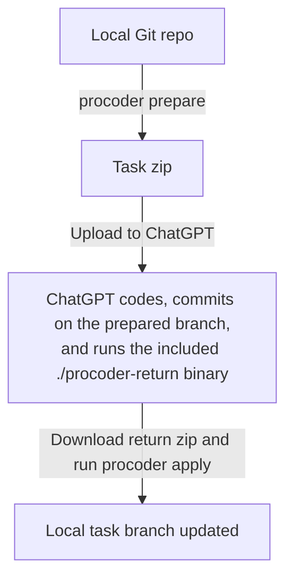

# procoder

`procoder` is a CLI for getting real Git commits back from ChatGPT's coding sandbox.

ChatGPT 5.4 Pro is the best coding model, but it is not available in Codex. `procoder` solves that specific problem: your repository stays local, ChatGPT works inside its locked-down sandbox, and you still get real commits back through a clean upload/download workflow powered by `git bundle`.

The workflow is simple:

1. You run `procoder prepare` and upload the generated zip.
2. ChatGPT works inside that package and gives you an optimized incremental Git bundle as a zip file.
3. You run `procoder apply`, which applies the commit ChatGPT made.

It is Git-native, not a patch-copying workaround.

## Install

Install globally with npm:

```bash
npm i -g procoder-cli
procoder --help
```

## Quick Start

```bash
procoder prepare
```

Upload the generated task package to ChatGPT and give it a prompt like:

```text
Make the requested changes in this repository.

Commit them on the prepared branch.

Then run ./procoder-return and give me the sandbox path to the generated zip.
```

After downloading the return package locally:

```bash
procoder apply procoder-return-<exchange-id>.zip
```

If you want to inspect the import first:

```bash
procoder apply procoder-return-<exchange-id>.zip --dry-run
```

## Why `git bundle` is the right primitive

`git bundle` is what makes this workflow feel native instead of fragile.

It lets `procoder` move Git commits, trees, blobs, and refs as a portable file, without requiring a network connection or a Git server. That matters because the ChatGPT sandbox can work with Git locally, but it cannot push to your remote.

Using an incremental bundle also keeps the return package small. The sandbox sends back only the objects created after `prepare`, not the whole repository again.

## Workflow Diagram



## The Three Tools

### `procoder prepare`

Runs locally in your clean repository.

It creates a dedicated task branch, builds a sanitized export of your repo, injects the `procoder-return` helper, and writes a task zip you can upload to ChatGPT.

### `./procoder-return`

Runs inside the exported repository in the ChatGPT sandbox.

It is a simple agent-friendly binary with no arguments or subcommands. After making one or more commits, the agent runs `./procoder-return`, and then sends back the path to the generated zip file.

### `procoder apply`

Runs locally in your original repository.

It verifies the returned bundle, checks whether the target refs are still safe to update, and then imports the returned commits into your repo.

## How it works under the hood

At a high level, `procoder` works because it ships Git history into the sandbox and ships only new Git history back out.

### 1. `prepare` makes an offline-capable repo

The task package is a sanitized Git repository, not just a folder of files.

That export:

- includes your tracked files
- includes local branches and tags for read-only context
- creates a dedicated task branch for the exchange
- strips remotes, credentials, hooks, reflogs, and other local-only Git state
- includes a Linux `procoder-return` helper binary at the repo root

So when ChatGPT opens the zip, it already has a working repo with real history and a branch ready to commit on. No internet connection is required for that part because the relevant Git state is already inside the upload.

### 2. ChatGPT returns only the incremental update

After ChatGPT commits its changes, `./procoder-return` does not re-export the entire repository.

Instead, it creates:

- `procoder-return.json`
  a small manifest describing the returned refs and commit IDs
- `procoder-return.bundle`
  an incremental Git bundle containing only the new objects needed to move those refs forward

That is the key idea. The return package is a portable Git layer that can be applied on top of the base commit prepared earlier.

### 3. `apply` verifies before it updates anything

When you run `procoder apply`, the CLI verifies the bundle, imports it into a temporary namespace, checks that the imported refs match the manifest, and only then updates your local task branch when it is safe.

If the branch moved locally, or the return package tries to update something outside the allowed exchange branch family, `procoder` fails clearly instead of guessing.

That gives you the practical feeling of "ChatGPT committed to my repo", while still keeping the operation local and controlled.

## Current V1 Constraints

The happy path is intentionally narrow:

- run `procoder prepare` from a clean repo
- no Git LFS support
- no submodule support
- returned work must stay inside the prepared exchange branch family
- tag changes are not part of the V1 return flow

Those constraints keep the round trip predictable and let `apply` behave like "update when safe, otherwise fail."

## Docs

- [How It Works](docs/how-it-works.md)
- [Command Reference](docs/commands.md)
- [Agent Guidance](AGENTS.md)
- [Maintainer Notes](CONTRIBUTORS.md)
