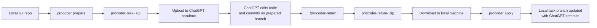

# procoder

`procoder` is a CLI for getting real Git commits back from ChatGPT's coding sandbox.

It is built for a very specific workflow:

- your local repository lives on your machine
- ChatGPT can code inside its locked-down sandbox, but it cannot reach your Git remote or your local filesystem over the network
- you still want ChatGPT to work on a real branch, make real commits, and hand the result back in a way that applies cleanly to your repo

`procoder` bridges that gap with an upload/download exchange built on zip files and `git bundle`.

## Why this exists

ChatGPT's coding sandbox is useful because it already has a lot of developer tooling available out of the box, including environments for languages like Python, TypeScript, Go, and Java. The catch is that it is isolated: no normal internet access, no direct connection to your Git remote, and no way to push straight into your repository.

`procoder` turns that limitation into a workflow:

1. You prepare a clean, portable task package from your repo.
2. ChatGPT works inside that package, commits on a prepared branch, and exports only the incremental Git result.
3. You apply that result locally so it feels like ChatGPT committed to your repo for you.

The important part is that this is not a patch-copying tool. ChatGPT works in a real Git repository and returns real Git history.

## How the round trip feels

From the perspective of a user who just wants a coding task done, the normal flow is:

1. Run `procoder prepare` in a clean repo, then upload the generated `procoder-task-<exchange-id>.zip` to ChatGPT with your task.
2. ChatGPT works in that repo, commits on the already-prepared task branch, then runs `./procoder-return` to create a small return package.
3. Download `procoder-return-<exchange-id>.zip` and run `procoder apply <return-package.zip>` in your original repo.

That is the whole user story. The rest of the tool exists to make those three steps safe, portable, and Git-native.

## Workflow Diagram



## The Three Tools

### `procoder prepare`

Runs locally in your clean repository.

It creates a dedicated task branch, builds a sanitized export of your repo, injects the `procoder-return` helper, and writes a task zip you can upload to ChatGPT.

### `./procoder-return`

Runs inside the exported repository in the ChatGPT sandbox.

It checks that the work was done on the allowed task branch family, bundles only the new Git objects and ref updates, and writes a return zip for download.

### `procoder apply`

Runs locally in your original repository.

It verifies the returned bundle, checks whether the target refs are still safe to update, and then imports the returned commits into your repo.

## How it works under the hood

At a high level, `procoder` works because it ships Git history into the sandbox and ships only new Git history back out.

### 1. `prepare` makes an offline-capable repo

The task package is a sanitized Git repository, not just a folder of files.

That export:

- includes your tracked files
- includes local branches and tags for read-only context
- creates a dedicated task branch for the exchange
- strips remotes, credentials, hooks, reflogs, and other local-only Git state
- includes a Linux `procoder-return` helper binary at the repo root

So when ChatGPT opens the zip, it already has a working repo with real history and a branch ready to commit on. No internet connection is required for that part because the relevant Git state is already inside the upload.

### 2. ChatGPT returns only the incremental update

After ChatGPT commits its changes, `./procoder-return` does not re-export the entire repository.

Instead, it creates:

- `procoder-return.json`
  a small manifest describing the returned refs and commit IDs
- `procoder-return.bundle`
  an incremental Git bundle containing only the new objects needed to move those refs forward

That is the key idea. The return package is a portable Git layer that can be applied on top of the base commit prepared earlier.

### 3. `apply` verifies before it updates anything

When you run `procoder apply`, the CLI verifies the bundle, imports it into a temporary namespace, checks that the imported refs match the manifest, and only then updates your local task branch when it is safe.

If the branch moved locally, or the return package tries to update something outside the allowed exchange branch family, `procoder` fails clearly instead of guessing.

That gives you the practical feeling of "ChatGPT committed to my repo", while still keeping the operation local and controlled.

## Why `git bundle` is the right primitive

`git bundle` is what makes this workflow feel native instead of fragile.

It lets `procoder` move Git commits, trees, blobs, and refs as a portable file, without requiring a network connection or a Git server. That matters because the ChatGPT sandbox can work with Git locally, but it cannot push to your remote.

Using an incremental bundle also keeps the return package small. The sandbox sends back only the objects created after `prepare`, not the whole repository again.

## Install

Install globally with npm:

```bash
npm i -g procoder-cli
procoder --help
```

The installer fetches two binaries when release assets are available:

- the local `procoder` CLI for your machine
- the packaged `linux/amd64` `procoder-return` helper used inside task packages

If release assets are unavailable, `scripts/postinstall.js` falls back to building both binaries locally with Go.

## Quick Start

```bash
procoder prepare
```

Upload the generated task package to ChatGPT and give it a prompt like:

```text
Make the requested changes in this repository, commit them on the prepared branch, then run ./procoder-return and give me the sandbox path to the generated zip.
```

After downloading the return package locally:

```bash
procoder apply procoder-return-<exchange-id>.zip
```

If you want to inspect the import first:

```bash
procoder apply procoder-return-<exchange-id>.zip --dry-run
```

## Current V1 Constraints

The happy path is intentionally narrow:

- run `procoder prepare` from a clean repo
- no Git LFS support
- no submodule support
- returned work must stay inside the prepared exchange branch family
- tag changes are not part of the V1 return flow

Those constraints keep the round trip predictable and let `apply` behave like "update when safe, otherwise fail."

## Docs

- [How It Works](docs/how-it-works.md)
- [Command Reference](docs/commands.md)
- [Agent Guidance](AGENTS.md)
- [Maintainer Notes](CONTRIBUTORS.md)

## Development

Common local commands:

```bash
make fmt
make test
make vet
make lint
make check
make build
make build-helper
make build-all
make install-local
```

`make build-all` produces the release binaries for the host CLI targets plus the packaged helper asset `procoder-return_linux_amd64`.
